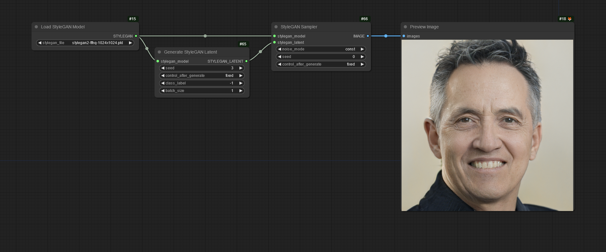
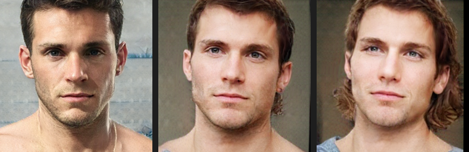
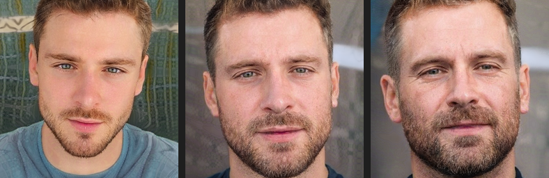
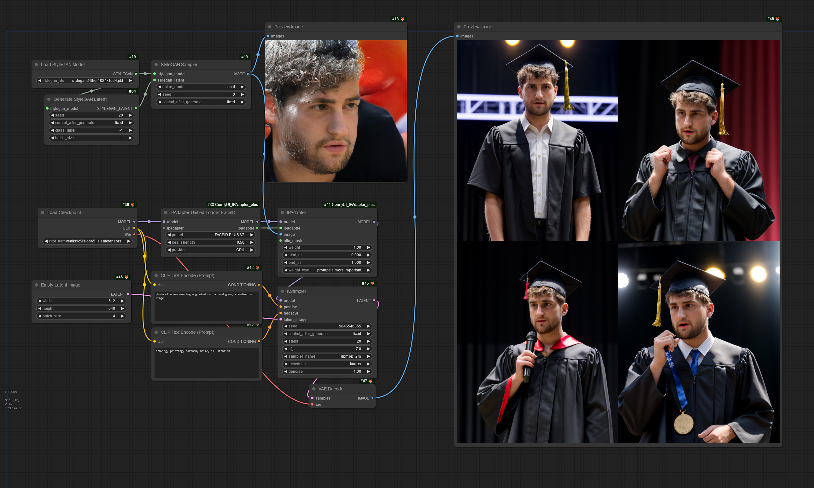

# ComfyUI-StyleGan

Basic support for StyleGAN2 and StyleGAN3 models.  


Original:  
https://github.com/NVlabs/stylegan3

Models:  
- https://catalog.ngc.nvidia.com/orgs/nvidia/teams/research/models/stylegan2/files  
- https://catalog.ngc.nvidia.com/orgs/nvidia/teams/research/models/stylegan3/files  
- https://github.com/justinpinkney/awesome-pretrained-stylegan2
- https://github.com/justinpinkney/awesome-pretrained-stylegan3
- https://huggingface.co/EFHQ/efhq_weights/tree/main/stylegan
- https://huggingface.co/quartzermz/BroGANv1.0.0

Place any models you want to use in `ComfyUI/models/stylegan/*.pkl` (create the folder if it doesn't exist).

## Safetensors

`LoadStyleGAN` prefers `.safetensors` checkpoints. `.pkl` files aren't just weights though, they're a pickled Python object (architecture + weights), so the first time you load a `.pkl`, `LoadStyleGAN` unpickles it once and automatically writes a `.safetensors` cache next to it (same folder, same name). Every load after that uses the cache and never touches `pickle` again.

The cache records the model's exact original constructor arguments (`init_kwargs`, captured automatically by `torch_utils.persistence` for every StyleGAN2/3 model) as metadata alongside the weights, so reloading reconstructs the exact same architecture rather than guessing hyperparameters from tensor shapes. Verified bit-exact against the original `.pkl` output.

To convert without loading into ComfyUI first (e.g. to batch-convert a models folder), run the same logic standalone:

```
python convert_to_safetensors.py model.pkl
```

## Seed mixing



`BlendStyleGANLatents` lerp/slerp-blends two latents using a coarse/mid/fine mask, for style-mixing between two generated faces. Drag the image above into ComfyUI to load the example workflow.

### Mixing from saved images instead of seeds



Any image saved with `SaveStyleGANLatentImg` has its exact latent embedded in the PNG. `LoadStyleGANLatentImg` reads that back out directly (instant, exact, no seed or generation history needed) so you can blend two *files* instead of two seeds: drag/copy the images into ComfyUI's `input/` folder, then `LoadStyleGANLatentImg` x2 → `BlendStyleGANLatents` → `StyleGANSampler`, same as the seed-mixer above. This only works on images that were saved with `SaveStyleGANLatentImg`; a PNG with no embedded latent (e.g. a plain photo) raises a clear error instead of silently failing — for that case, use `StyleGANInversion` instead, which approximates a latent for *any* image via optimization.

To try the example workflow above as-is (not just as a template), copy `examples/face_A.png` and `examples/face_B.png` into your `ComfyUI/input/` folder first — the workflow's two `LoadStyleGANLatentImg` nodes reference those exact filenames, which (unlike the seed-mixer example) aren't portable on their own since they're specific saved images, not a seed number.

## Latent direction discovery (GANSpace / SeFa)

`DiscoverGANSpaceDirections` and `DiscoverSeFaDirections` both find unsupervised edit directions in W-space, with no labeled attribute data required. Neither tells you what a direction does; use `StyleGANDirectionSweep` first to render a strength-sweep filmstrip for a given `component_index` and eyeball what it changes before committing to a strength.

- `DiscoverGANSpaceDirections` samples random latents and runs PCA over them. Directions are scaled to roughly "1 sigma" units, so `strength` around +/-1-3 is a good starting range with `ApplyStyleGANDirection`.
- `DiscoverSeFaDirections` eigen-decomposes the generator's style-modulation weights directly (no sampling, effectively instant). Directions are unit-normalized, so useful strengths are larger, e.g. +/-5-20.
- Component sign and ordering can vary between GANSpace runs/seeds (PCA sign ambiguity) - a negative `strength` just flips the edit direction, same as blend direction in `BlendStyleGANLatents`.
- `ApplyStyleGANDirection` moves a single latent along one component, optionally restricted to a coarse/mid/fine layer subset via the same `mask` convention as `BlendStyleGANLatents`. Chain multiple `ApplyStyleGANDirection` nodes to compose edits from several components.

You can also discover directions offline, without ComfyUI running, with `discover_directions.py`:

```
python discover_directions.py model.safetensors --method sefa
python discover_directions.py model.safetensors --method ganspace --num-samples 5000
python discover_directions.py model.safetensors --method sefa --sweep 0,1,2 --sweep-out sweep.png
```

This saves a `.safetensors` file (same folder as the model by default) with each component as its own named tensor (`component_00`, `component_01`, ...), and can optionally render a sweep-preview PNG grid for a few components in one shot (the `--sweep` option needs the compiled StyleGAN CUDA/MPS ops, same as running the model in ComfyUI; discovery itself does not). `LoadStyleGANDirections` loads this file: leave `direction_name` blank to get the whole batch back (for `StyleGANDirectionSweep`-style exploration by `component_index`), or fill it in once you know which component you want (e.g. `component_03`) to load just that one direction.


Example above: `BroGANv1.2.0`, GANSpace `component_02`, coarse mask, `StyleGANDirectionSweep` from 0 to 9 in 4 steps — a clean, disentangled smile direction that starts breaking down past ~strength 7-8 (visible ghosting at +9). Drag the image into ComfyUI to load the workflow.

**A note on MPS + PyTorch versions:** we found StyleGAN3 synthesis results can differ meaningfully between PyTorch versions on the same MPS device for the same seed/direction (verified: torch 2.7.0 and 2.10.0 reproduce cleanly, torch 2.14.0 gave visibly different, worse results for this same example). If a direction that should show a clear effect looks wrong or flat, try a different PyTorch version before assuming the direction itself is bad.

## StyleGAN + FaceID



StyleGAN's mapping network generates a face latent (and rendered face) far faster than a diffusion model, making it a good identity source for `IPAdapter FaceID`/InstantID: generate a candidate face with `GenerateStyleGANLatent` + `StyleGANSampler`, then feed that image into `IPAdapterUnifiedLoaderFaceID` to condition an SD1.5/SDXL checkpoint's generation on that identity. Drag the image above into ComfyUI to load the example workflow.

## Installation

StyleGAN uses custom CUDA extensions which are compiled at runtime, so unfortunately the setup process can be a bit of a pain.

You need CUDA Toolkit, ninja, and either GCC (Linux) or Visual Studio (Windows). Tested on Windows with CUDA Toolkit 11.7 and VS2019 Community. You may also need to add paths to the system PATH, CUDA_HOME, and LD_LIBRARY_PATH.

```
PATH:
C:\Program Files (x86)\Microsoft Visual Studio\2019\Community\VC\Tools\MSVC\14.29.30133\bin\Hostx64\x64
C:\Program Files (x86)\Microsoft Visual Studio\2019\Community\VC\Auxiliary\Build

CUDA_HOME:
C:\Program Files\NVIDIA GPU Computing Toolkit\CUDA\v11.7

LD_LIBRARY_PATH:
C:\Program Files\NVIDIA GPU Computing Toolkit\CUDA\v11.7\lib\x64
```

If you're using ComfyUI portable, the embedded python installation is probably also missing some necessary files. The only solution I found to this was to just copy them from a full system installation of python 3.10.x to the embedded installation.

From `C:/Users/username/AppData/Local/Programs/Python/Python310/include/*`  
to `ComfyUI_windows_portable/python_embeded/Include/*`  
(make sure you don't overwrite any file/folders that are already there)

And from `C:/Users/username/AppData/Local/Programs/Python/Python310/libs/*`  
to `ComfyUI_windows_portable/python_embeded/libs/*`

If all of that is set up correctly, when you run a StyleGAN workflow, it will first build the necessary PyTorch plugins (should take 30-60s), then generate an image. There will be a message in the console, and then subsequent images will be much faster to generate (measured at 64 images/sec on a 3090 with a large batch, although ComfyUI's tensor to PIL for previews will bottleneck realtime generation to more like 8 fps)

StyleGAN2:  
```
Setting up PyTorch plugin "bias_act_plugin"... Done.
Setting up PyTorch plugin "upfirdn2d_plugin"... Done.
```
StyleGAN3:  
```
Setting up PyTorch plugin "bias_act_plugin"... Done.
Setting up PyTorch plugin "filtered_lrelu_plugin"... Done.
```  

